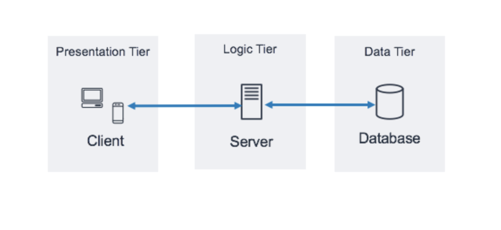

# Using databases for a Webshop

## Module
This module is a follow-up to the 'webshop-basis. We will first move our storage of users to a database. We will then expand the webshop with product pages, a shopping cart and an option to adjust the shopping cart.
 
 

## Learning - A three-tier architecture 

What's a three-tier architecture? 
A three-tier architecture is a software architecture pattern where the application is broken down into three logical tiers: 
1. Presentation tier 
2. Application tier 
3. Data tier 
 
In a three-tier application, all communication goes through the application tier. The presentation tier and the data tier cannot communicate directly with one another.
 
The following illustration shows an example of a simple, generic three-tier application. 

 
 
Three-tier architecture for our Webshop:
- Presentation : UI for the webshop
- Application: business logic used to process user inputs
- Data : runs on MySQL
 
 
Some advantages of a three-tier architecture:
* Modularity : each part can be managed independently of each other
* Security : can function as a sort of internal firewall, preventing SQL injections and other malicious exploits.

Some disadvantages of a three-tier architecture:
* Performance : physical seperation of servers may affect performance
* Complexity