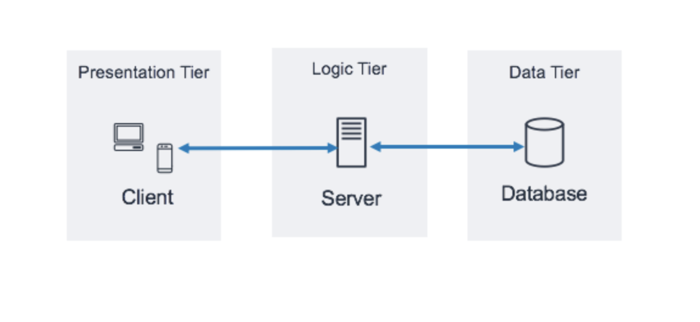

# Using databases for a Webshop

## Module
This module is a follow-up to the 'webshop-basis. We will first move our storage of users to a database. We will then expand the webshop with product pages, a shopping cart and an option to adjust the shopping cart.
 
### Learning - Designing a three-tier application 

What's a three-tier architecture? 
A three-tier architecture is a software architecture pattern where the application is broken down into three logical tiers: 
1. Presentation tier : where users can interact with the application
2. Business tier : where the data is processed using business rules
3. Data tier : where the data associated with the application is stored and managed
 
 
The following illustration shows an example of a simple, generic three-tier application. 

Note: In a three-tier application, all communication goes through the application tier. The presentation tier and the data tier cannot communicate directly with one another.
 
 
Three-tier application in web development:
- The web server is the presentation tier and provides the user interface (This is usually a web page or web site, such as an ecommerce site where the user adds products to the shopping cart, adds payment details or creates an account.)
- The application server corresponds to the middle tier, housing the business logic used to process user inputs (this is the tier that queries the inventory database to return product availability, or adds details to a customer's profile.)
- The database server is the data or backend tier of a web application, and runs on database management software (such as MySQL, Oracle, or PostgreSQL, for example)
 
 
Some advantages of a three-tier architecture:
* Modularity : each part can be managed independently of each other
* Security : can function as a sort of internal firewall, preventing SQL injections and other malicious exploits.
* Integrity : the logic tier can ensure that only important information is allowed to be updated in the database

Some disadvantages of a three-tier architecture:
* Performance : physical seperation of servers may affect performance
* Complexity
* Connection : the client does not maintain a persistent database connection